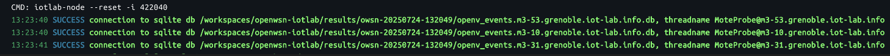
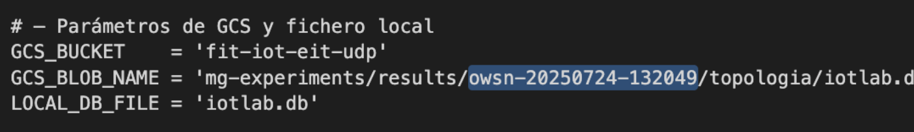
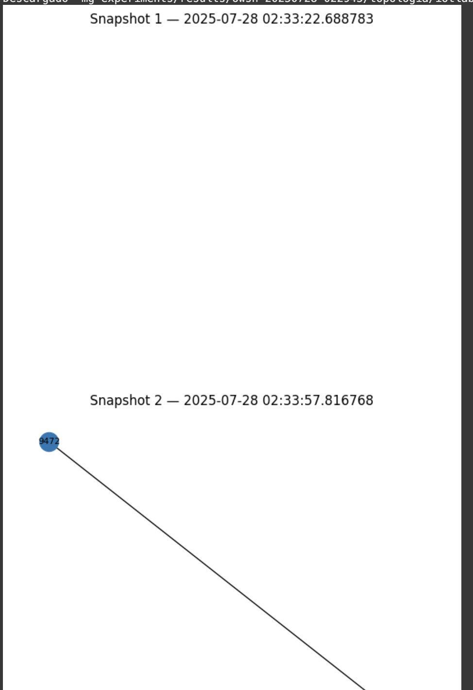
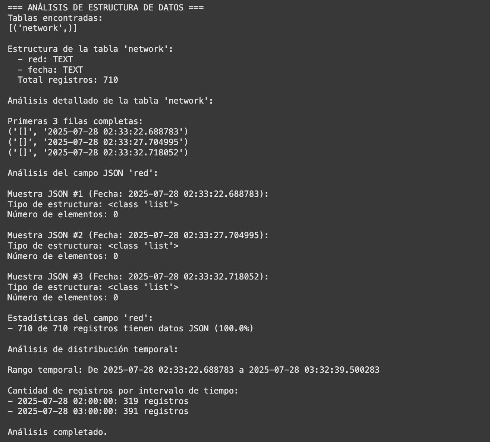
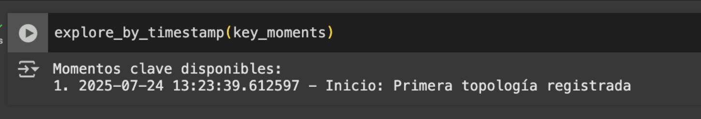
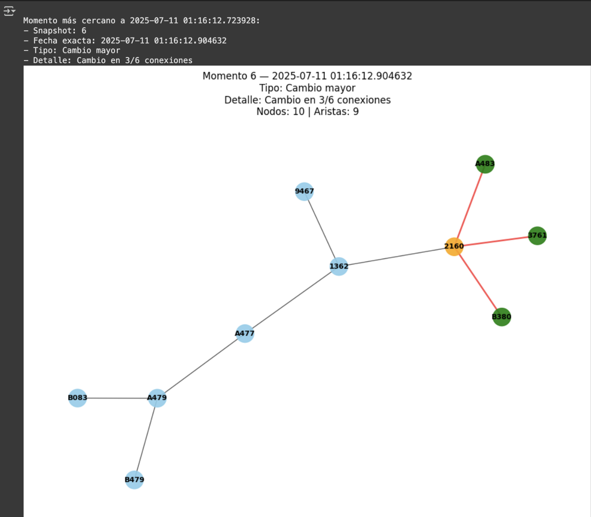
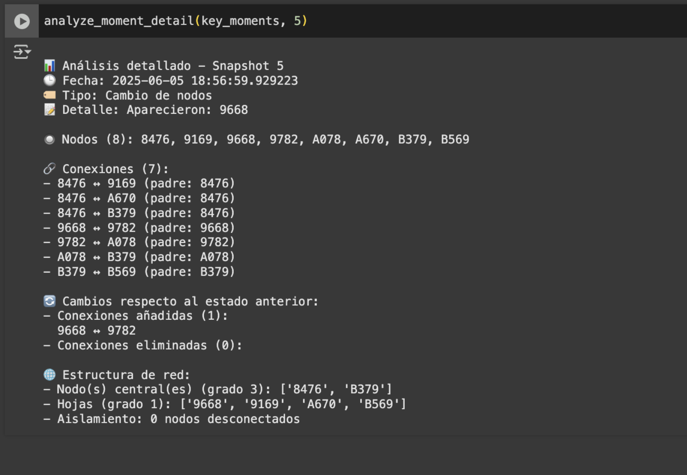

# Instrucciones de uso para crear pruebas y analizar topologías

## 📦 Crear imagen y levantar contenedor

1. Estar en la raíz del proyecto y correr el siguiente comando para crear la imagen:
   ```bash
   make build image 
   ```
2. Cuando esté lista la imagen, correr el siguiente comando para levantar el contenedor.  
   *(Importante: solicitar las variables de entorno necesarias)*  
   ```bash
   make run container
   ```
   

---

## 🧪 Creación de pruebas

1. Solicitar credenciales para ingresar a la plataforma:  
   👉 [https://www.iot-lab.info](https://www.iot-lab.info)

2. Verificar el estado de los dispositivos (nodos) deseados. Se deben utilizar aquellos con estado `"Alive"`:  
   

3. Abrir el puerto `3000` (esto habilita la interfaz generada al levantar el contenedor).  
   En esta interfaz se deben especificar:
   - Los **nodos a utilizar**
   - La **fecha**
   - Un **nombre de experimento**

   Los tipos de nodos:
   - `noise_list`: nodos que generan interferencia en la red
   - `node_list`: nodos generales que se comunican entre sí
   - `dagroots_list`: nodo raíz de la topología (emisor principal)

   Luego se deben **guardar los cambios** y presionar `Iniciar Experimentos`.  
   

4. Cuando el experimento esté corriendo, abrir el contenedor para ver los logs y copiar el **identificador** de la base de datos.  
   Este identificador será necesario para analizar la información generada.  
   

5. Ejemplo de identificador:  
   ```
   owsn-20250724-132049
   ```
   Con este ID ya se puede acceder al dataset del experimento.

---

# 🔍 Algoritmo para visualizar topologías [analisis_topologia.ipynb]

## 🧩 Primer bloque de código

1. Autenticarse con tu cuenta de Google Colab (permite acceso a GCS).
2. Descargar `iotlab.db` desde el bucket `fit-iot-eit-udp`.
3. Leer las filas de la tabla `network`, ordenadas por fecha.
4. Para cada fila, construir un `frozenset` de aristas y comparar con el snapshot previo.
5. Dibujar un gráfico *inline* solo cuando la topología cambia, etiquetado con su `timestamp`.
6. Colocar el identificador de logs en la siguiente sección:  
   
7. Al correr el bloque, se mostrarán los snapshots de la topología:  
   

---

## 📊 Segundo bloque de código

1. **Analiza la estructura de la base de datos**: muestra tablas, columnas y número de registros.
2. **Examina la tabla `network`**: analiza campos JSON, estructura y estadísticas.
3. **Estudia la distribución temporal**: analiza fechas y frecuencia de registros.
4. **Ejecuta un análisis completo** de todo lo anterior en conjunto.
5. Resultado:  
   

---

## 🔄 Tercer bloque de código: Detección de momentos clave

1. **Importa bibliotecas**: `networkx`, `pandas`, `matplotlib`.
2. **Detecta momentos clave**: analiza cambios en nodos/conexiones (>30%).
3. **Visualiza grafos**: colorea nodos según cambios (nuevos, eliminados, modificados).
4. **Genera resumen**: tabla con snapshots clave, filtrables por `timestamp`.
5. **Manejo de errores**: valida fechas y controla JSONs vacíos/corruptos.
6. **Función principal**: detecta cambios en jerarquías (padres), nodos nuevos (🟢) y eliminados (🔴).
7. Visualización de momentos clave:  
   
8. Ejemplo de gráfica generada:  
   

---

## 🧾 Cuarto bloque de código: MiniReporte detallado (BONUS)

1. **Valida el snapshot solicitado**.
2. **Muestra metadatos**:
   - Fecha
   - Tipo de evento
   - Descripción del cambio
3. **Analiza componentes**:
   - Lista nodos y sus conexiones (padre-hijo)
   - Detecta cambios:
     - ✅ conexiones añadidas
     - ❌ conexiones eliminadas
4. **Evalúa la topología** usando `networkx`:
   - Nodos centrales (mayor grado)
   - Hojas (1 conexión)
   - Nodos aislados (0 conexiones)
5. **Formato visual claro** con emojis y sangrías.  
   Ejemplo:
   ```
   📊 Snapshot #3
   🔗 A ↔ B ✅
   🔗 C ↔ D ❌
   ```
6. Si hay cambios entre snapshots, muestra comparativa detallada.  
   

---

> 💡 Para más detalles sobre cada bloque de código, revisar el notebook.
