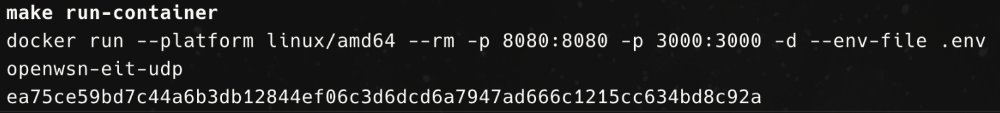
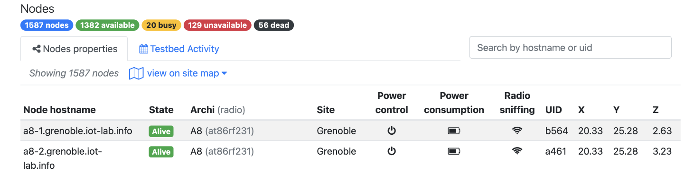

## Crear imagen y levantar contenedor

1. Estar en la raiz del proyecto y correr el siguiente comando, para crear la imagen
 ```bash
 	make build image 
```
2. Cuando este lista la imagen, correr el siguiente comando, para levantar el contenedor.(importante solicitar las variables de entorno)
 ```bash
 	make run container
```

## Creación de pruebas 
1. Solicitar credenciales, para ingresar a la plataforma ==https://www.iot-lab.info/==.
2. Verificar estado de los dispositivos(nodos) deseados a ocupar, ya que existen 4 estados para uno. La idea es ocupar los que tengan estado "==Alive=="
3. Abrir el puerto 3000, esto abrira un interfaz que se creo al momento de levantar el contenedor. Aquí se deben colocar los nodos que se van a utilizar, ademas de la fecha y algún nombre del experimento. Tipos de nodos: "noise_list" serán todos los nodos que causen ruido dentro de la topología, "node_list" serán los nodos generales de la topología, su función es que se puedan comunicar entre si, "dagroots_list" será el nodo raíz, desde donde parte el envío de mensajes. Luego se ==guardan los cambios== y se inicia el experimento  ==Iniciar Experimentos==![[images/nodes_config.png]]
4. Cuando este corriendo el experimento, abrir el contenedor para ver los logs y copiar el identificador de la bdd para poder tratar la informacion genera de la topologia![[Captura de pantalla 2025-07-24 a la(s) 9.29.36 a.m..png]]
5. en este caso el identificador de la bdd seria "==owsn-20250724-132049==", aqui estan todos los logs del experimento, con esto ya podemos acceder al dataset para manipularlo
-----
